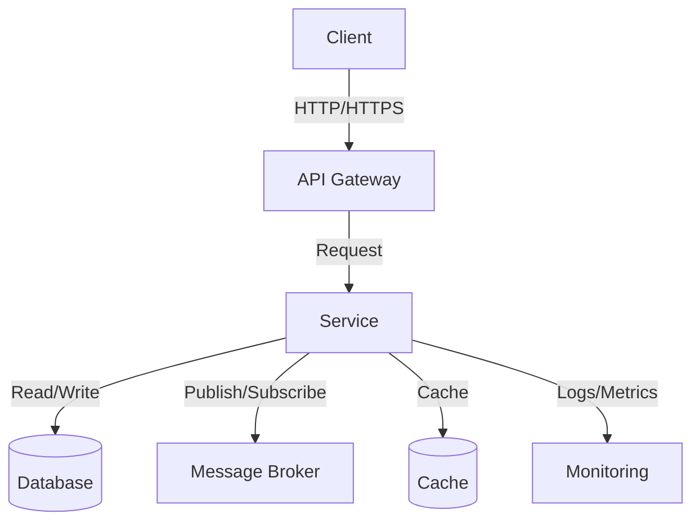
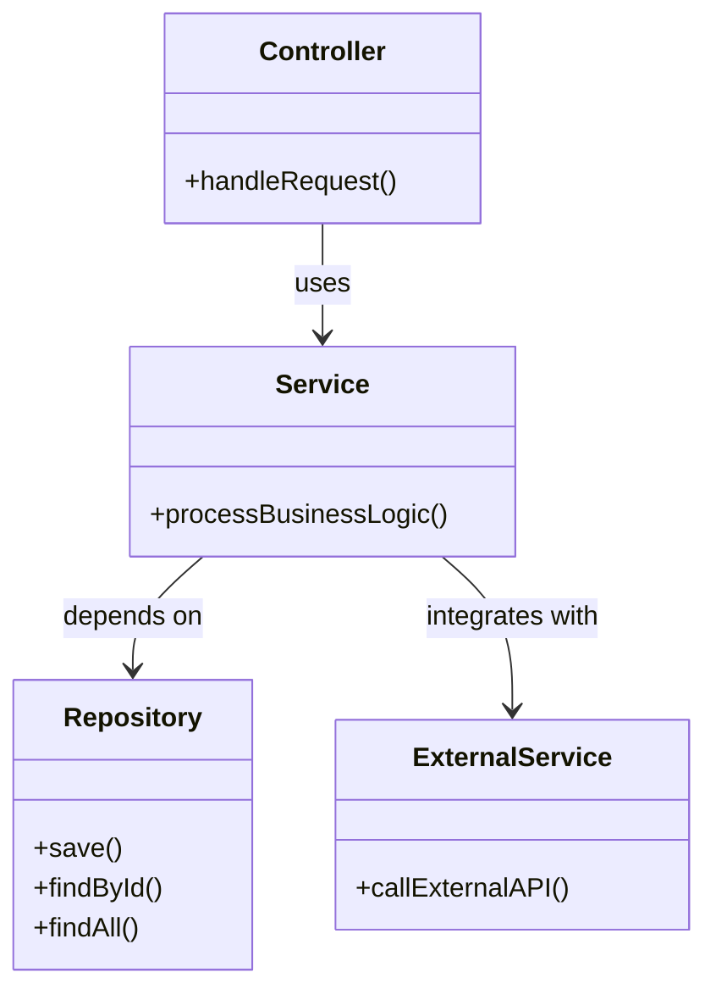
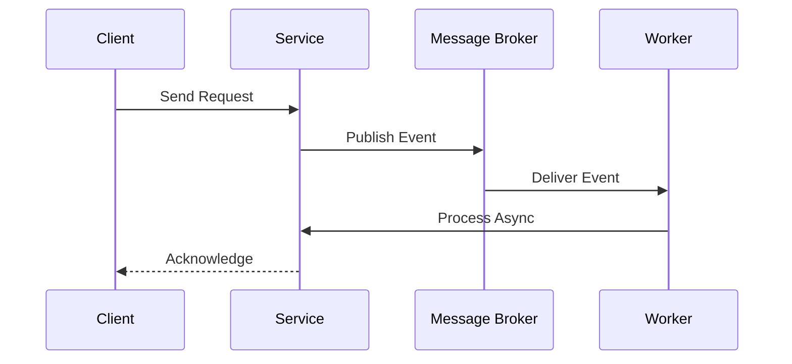
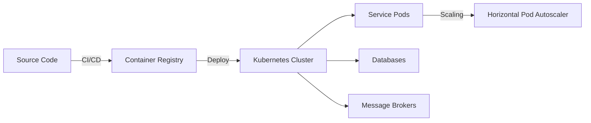
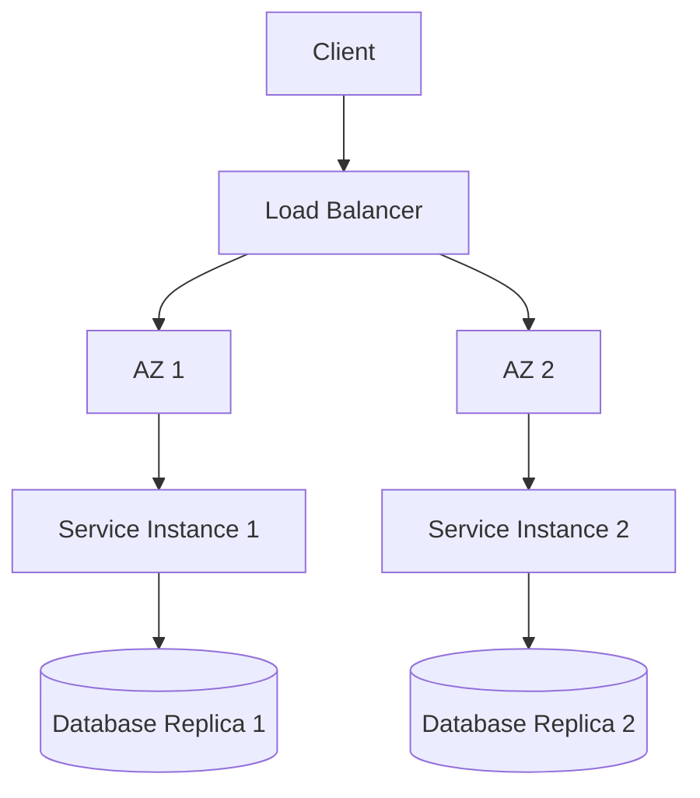

# [Service Name] - Architecture

## Table of Contents
1. [Overview](#overview)
2. [System Architecture](#system-architecture)
3. [Component Diagram](#component-diagram)
4. [Data Flow](#data-flow)
5. [Deployment Architecture](#deployment-architecture)
6. [Security Architecture](#security-architecture)
7. [Scalability](#scalability)
8. [High Availability](#high-availability)
9. [Performance Considerations](#performance-considerations)
10. [Technology Stack](#technology-stack)
11. [Integration Points](#integration-points)
12. [Monitoring and Observability](#monitoring-and-observability)

## Overview

[Provide a high-level overview of the service's architecture, its purpose, and key architectural decisions.]

## System Architecture

### High-Level Architecture



### Key Components

1. **API Layer**
   - RESTful/gRPC endpoints
   - Request validation
   - Authentication/Authorization
   - Rate limiting

2. **Service Layer**
   - Business logic
   - Domain models
   - Transaction management

3. **Data Access Layer**
   - Database interactions
   - Caching
   - Data validation

4. **Integration Layer**
   - External service clients
   - Message producers/consumers
   - Event handlers

## Component Diagram



## Data Flow

### Request Flow

1. Client sends HTTP request to API Gateway
2. API Gateway validates and routes request
3. Authentication/Authorization is performed
4. Request reaches appropriate controller
5. Controller delegates to service layer
6. Service executes business logic
7. Data is persisted/retrieved
8. Response is returned to client

### Event Flow



## Deployment Architecture

### Infrastructure

- **Containerization**: Docker
- **Orchestration**: Kubernetes
- **Service Mesh**: Istio/Linkerd (optional)
- **CI/CD**: GitHub Actions/Jenkins

### Environment Setup

| Environment | Purpose | Access |
|-------------|---------|--------|
| Development | Local development | Developers |
| Test | Automated testing | CI/CD Pipeline |
| Staging | Pre-production testing | QA Team |
| Production | Live environment | Operations |

### High-Level Deployment



## Security Architecture

### Authentication & Authorization

- **Authentication**: OAuth 2.0 / JWT
- **Authorization**: Role-Based Access Control (RBAC)
- **Secrets Management**: HashiCorp Vault / Kubernetes Secrets

### Data Protection

- **In Transit**: TLS 1.3
- **At Rest**: Encryption
- **Sensitive Data**: Masking/Redaction

### Network Security

- **Firewall Rules**: Least privilege
- **Network Policies**: Pod-to-Pod communication
- **API Gateway**: WAF, Rate Limiting

## Scalability

### Horizontal Scaling

- **Stateless Services**: Scale out based on CPU/Memory
- **Stateful Services**: Sharding/Partitioning
- **Database**: Read Replicas, Caching

### Caching Strategy

| Cache Type | Implementation | TTL | Invalidation Strategy |
|------------|----------------|-----|----------------------|
| Local Cache | Caffeine | 5m | Time-based |
| Distributed | Redis | 30m | LRU Eviction |

## High Availability

### Multi-AZ Deployment



### Disaster Recovery

- **RPO**: 5 minutes
- **RTO**: 15 minutes
- **Backup Strategy**: Daily full + incremental
- **Failover**: Automated with manual verification

## Performance Considerations

### Database Optimization

- **Indexing Strategy**:
  ```sql
  CREATE INDEX idx_column ON table(column) 
  WHERE condition;
  ```
- **Query Optimization**: Explain plan analysis
- **Connection Pooling**: HikariCP configuration

### Caching Strategy

- **Cache-Aside Pattern**:
  ```java
  public Data getData(String key) {
      Data data = cache.get(key);
      if (data == null) {
          data = database.get(key);
          cache.put(key, data);
      }
      return data;
  }
  ```

## Technology Stack

### Core Technologies

| Category | Technology |
|----------|------------|
| Language | Java 17 |
| Framework | Spring Boot 3.x |
| Build Tool | Maven/Gradle |
| Container | Docker |
| Orchestration | Kubernetes |

### Dependencies

```xml
<dependencies>
    <!-- Spring Boot Starters -->
    <dependency>
        <groupId>org.springframework.boot</groupId>
        <artifactId>spring-boot-starter-web</artifactId>
    </dependency>
    <dependency>
        <groupId>org.springframework.boot</groupId>
        <artifactId>spring-boot-starter-data-jpa</artifactId>
    </dependency>
    <!-- Add other dependencies -->
</dependencies>
```

## Integration Points

### External Services

| Service | Protocol | Authentication | Rate Limit |
|---------|----------|----------------|------------|
| Payment Service | gRPC | mTLS | 1000 RPM |
| Notification Service | REST | JWT | 500 RPM |

### Message Brokers

- **Kafka Topics**:
  - `orders.created`
  - `payments.processed`
  - `notifications.sent`

## Monitoring and Observability

### Metrics

- **JVM Metrics**: Memory, GC, Threads
- **Application Metrics**: Request rates, Latency, Error rates
- **Business Metrics**: Orders processed, Users active

### Logging

- **Structured Logging**: JSON format
- **Log Levels**: ERROR, WARN, INFO, DEBUG
- **Log Aggregation**: ELK Stack

### Tracing

- **Distributed Tracing**: Jaeger/Zipkin
- **Sampling Rate**: 10% in production
- **Trace Context**: W3C Trace Context

## Future Considerations

1. **Service Mesh Adoption**:
   - mTLS between services
   - Circuit breaking
   - Fine-grained traffic control

2. **Multi-region Deployment**:
   - Active-Active setup
   - Global load balancing
   - Data replication strategy

3. **Performance Optimization**:
   - Query optimization
   - Caching strategy review
   - Async processing
