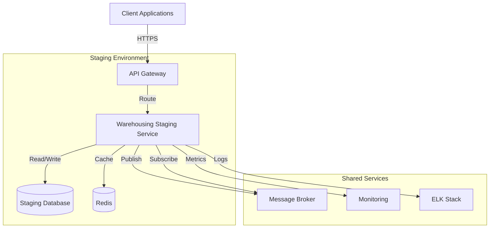
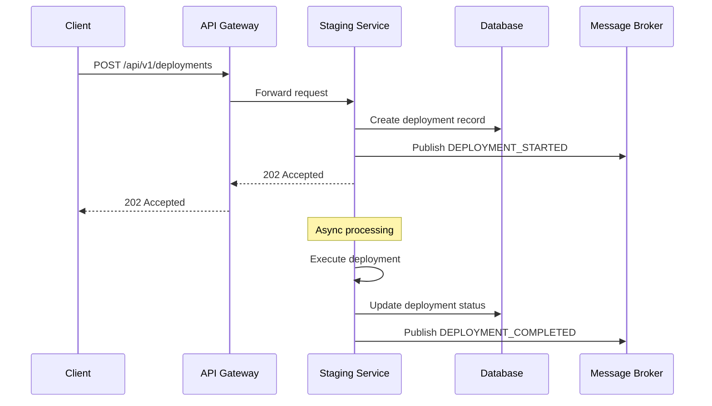
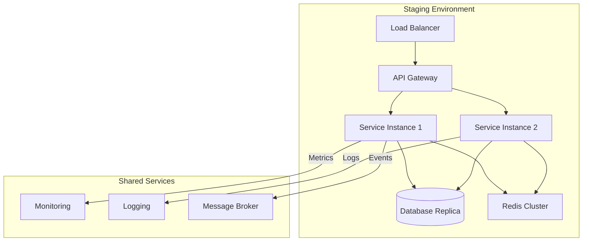

# Warehousing Staging - Architecture

## Table of Contents
1. [System Overview](#system-overview)
2. [Architecture Diagram](#architecture-diagram)
3. [Component Architecture](#component-architecture)
4. [Data Flow](#data-flow)
5. [Deployment Architecture](#deployment-architecture)
6. [Security Architecture](#security-architecture)
7. [Scalability](#scalability)
8. [High Availability](#high-availability)
9. [Performance Considerations](#performance-considerations)
10. [Technology Stack](#technology-stack)
11. [Integration Points](#integration-points)
12. [Monitoring and Observability](#monitoring-and-observability)

## System Overview

The Warehousing Staging Service provides a controlled environment for testing and validating changes before they are deployed to production. It mirrors the production environment while maintaining isolation to prevent any impact on live operations.

## Architecture Diagram



## Component Architecture

### 1. API Layer
- **API Gateway**: Handles request routing, authentication, and rate limiting
- **REST Controllers**: Process HTTP requests and return responses
- **WebSocket**: Real-time updates for deployment status

### 2. Service Layer
- **Deployment Service**: Manages deployment lifecycle
- **Environment Service**: Handles environment configuration
- **Notification Service**: Sends deployment notifications

### 3. Data Access Layer
- **Repository**: Database interactions
- **Cache Manager**: Redis caching
- **Message Producer/Consumer**: Event publishing/subscribing

### 4. Integration Layer
- **External Service Clients**: Integration with other services
- **Webhook Handlers**: Process incoming webhooks

## Data Flow

### 1. Deployment Initiation


### 2. Environment Provisioning
1. Receive provisioning request
2. Validate request parameters
3. Allocate resources
4. Configure environment
5. Update inventory
6. Notify stakeholders

## Deployment Architecture

### Infrastructure
- **Containerization**: Docker
- **Orchestration**: Kubernetes
- **Service Mesh**: Istio
- **CI/CD**: GitHub Actions

### Environment Topology


## Security Architecture

### Authentication & Authorization
- **OAuth 2.0** with JWT
- **RBAC** (Role-Based Access Control)
- **mTLS** for service-to-service communication

### Data Protection
- **Encryption at Rest**: AES-256
- **Encryption in Transit**: TLS 1.3
- **Secrets Management**: HashiCorp Vault

### Network Security
- **Network Policies**: Restrict pod-to-pod communication
- **WAF**: Web Application Firewall rules
- **DDoS Protection**: Cloud provider DDoS protection

## Scalability

### Horizontal Scaling
- **Stateless Services**: Scale based on CPU/Memory
- **Stateful Services**: Use sharding/partitioning
- **Database**: Read replicas, connection pooling

### Caching Strategy
| Layer | Technology | TTL | Invalidation |
|-------|------------|-----|-------------|
| L1 | Caffeine | 5m | Time-based |
| L2 | Redis | 30m | LRU |

## High Availability

### Multi-AZ Deployment
- Deployed across 3 Availability Zones
- Auto-scaling group with min 2 instances per AZ
- Cross-region replication for critical data

### Disaster Recovery
- **RPO**: 5 minutes
- **RTO**: 15 minutes
- **Backup Strategy**: Daily full + hourly incrementals

## Performance Considerations

### Database Optimization
- **Indexing Strategy**:
  ```sql
  CREATE INDEX idx_deployment_status 
  ON deployments(status, created_at);
  ```
- **Query Optimization**: Explain plan analysis
- **Connection Pooling**: HikariCP with monitoring

### Caching Strategy
- **Cache-Aside Pattern**:
  ```java
  public Deployment getDeployment(String id) {
      return cache.get(id, () -> 
          repository.findById(id)
                  .orElseThrow(NotFoundException::new)
      );
  }
  ```

## Technology Stack

### Core Technologies
| Category | Technology |
|----------|------------|
| Language | Java 17 |
| Framework | Spring Boot 3.1 |
| Build Tool | Maven |
| Container | Docker |
| Orchestration | Kubernetes |
| Database | MySQL 8.0 |
| Cache | Redis 7.0 |
| Message Broker | Apache Kafka |

### Dependencies
```xml
<dependencies>
    <!-- Spring Boot Starters -->
    <dependency>
        <groupId>org.springframework.boot</groupId>
        <artifactId>spring-boot-starter-web</artifactId>
    </dependency>
    <dependency>
        <groupId>org.springframework.boot</groupId>
        <artifactId>spring-boot-starter-data-jpa</artifactId>
    </dependency>
    <dependency>
        <groupId>org.springframework.kafka</groupId>
        <artifactId>spring-kafka</artifactId>
    </dependency>
    
    <!-- Monitoring -->
    <dependency>
        <groupId>org.springframework.boot</groupId>
        <artifactId>spring-boot-starter-actuator</artifactId>
    </dependency>
    <dependency>
        <groupId>io.micrometer</groupId>
        <artifactId>micrometer-registry-prometheus</artifactId>
    </dependency>
</dependencies>
```

## Integration Points

### Internal Services
| Service | Protocol | Auth | Rate Limit |
|---------|----------|------|------------|
| User Service | gRPC | mTLS | 1000 RPM |
| Notification Service | REST | JWT | 500 RPM |
| Monitoring Service | HTTP | API Key | 100 RPM |

### External Services
| Service | Purpose | Auth |
|---------|---------|------|
| GitHub | Source Code | OAuth2 |
| Docker Hub | Container Registry | Token |
| AWS S3 | Artifact Storage | IAM |

## Monitoring and Observability

### Metrics
- **JVM Metrics**: Memory, GC, Threads
- **Application Metrics**: Request rates, Latency, Error rates
- **Business Metrics**: Deployments, Success/Failure rates

### Logging
- **Structured Logging**: JSON format
- **Log Levels**: ERROR, WARN, INFO, DEBUG, TRACE
- **Log Aggregation**: ELK Stack

### Tracing
- **Distributed Tracing**: Jaeger
- **Sampling Rate**: 100% in staging
- **Trace Context**: W3C Trace Context

## Future Considerations

1. **Service Mesh Adoption**:
   - mTLS between services
   - Circuit breaking
   - Fine-grained traffic control

2. **Multi-region Deployment**:
   - Active-Active setup
   - Global load balancing
   - Data replication strategy

3. **Performance Optimization**:
   - Query optimization
   - Caching strategy review
   - Async processing

4. **Observability Enhancements**:
   - Custom metrics
   - Advanced alerting
   - Anomaly detection
